## 1. Введение

### 1.1. Назначение документа

Настоящий документ описывает технические требования к разработке платформы **MiniToolStream** — системы для эффективной транспортировки и обработки больших потоков данных в режиме реального времени.

### 1.2. Область применения

MiniToolStream предназначен для использования в высоконагруженных распределенных системах, требующих:
- Надежной асинхронной передачи данных между микросервисами
- Синхронизации данных между различными подразделениями или системами
- Построения event-driven архитектур
- Обработки сообщений произвольного размера и формата

### 1.3. Проблематика

Существующие решения для обмена сообщениями (Apache Kafka, RabbitMQ, Redis Streams) имеют ограничения:
- **Kafka**: ограничения на размер сообщения (по умолчанию 1MB), сложность масштабирования
- **RabbitMQ**: низкая производительность при больших объемах данных
- **Redis**: хранение только в памяти, отсутствие персистентности для больших объектов

**Проблема:** Необходимость эффективной работы с сообщениями произвольного размера (от байтов до гигабайтов) при сохранении высокой производительности и надежности.

### 1.4. Цель проекта

Повышение эффективности работы очередей сообщений в высоконагруженных системах за счет гибридного подхода к хранению данных:
- **Метаданные** → быстрая in-memory СУБД (Tarantool)
- **Полезная нагрузка (payload)** → масштабируемое объектное хранилище (MinIO/S3)

### 1.5. Задачи

1. Разработать инструмент синхронизации данных между гетерогенными системами
2. Обеспечить возможность хранения сообщений любого размера и формата
3. Реализовать высокопроизводительную систему с минимальной задержкой
4. Обеспечить надежность и персистентность данных
5. Предоставить простой и удобный API для разработчиков

---


---


## 2. Архитектура и проектирование системы

Данный раздел содержит подробное описание архитектуры MiniToolStream с использованием диаграмм UML/Mermaid для визуализации компонентов, потоков данных, моделей и взаимодействий.

### 2.1. Общая архитектура и потоки данных

### Component Diagram

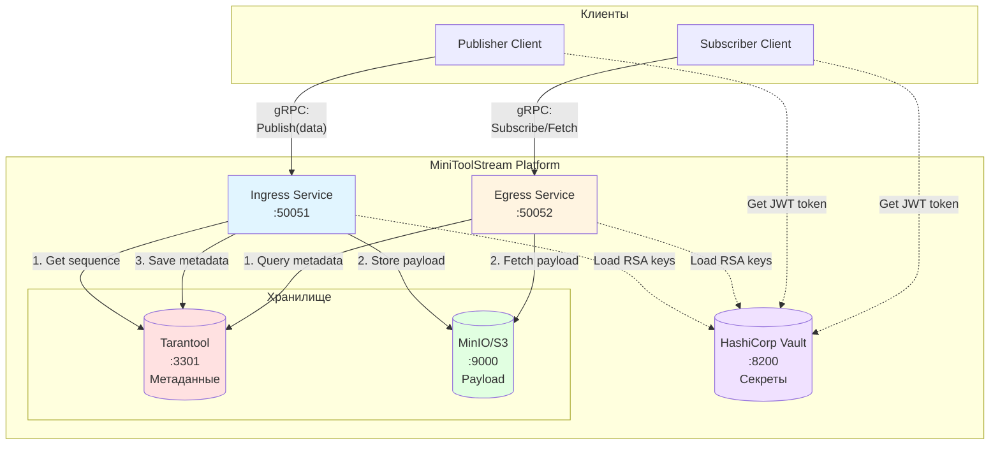

### Data Flow Diagram

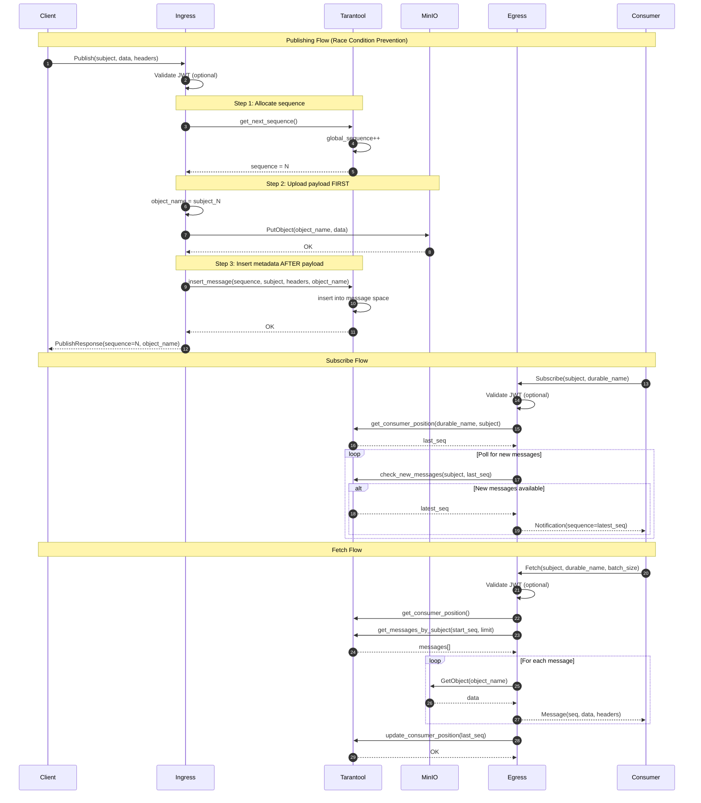

---

### 2.2. Модель данных и API

### Class Diagram - Data Models

```mermaid
classDiagram
    class PublishRequest {
        +string subject
        +bytes data
        +map~string,string~ headers
    }

    class PublishResponse {
        +uint64 sequence
        +string object_name
        +int64 status_code
        +string error_message
    }

    class SubscribeRequest {
        +string subject
        +uint64 start_sequence
        +string durable_name
    }

    class Notification {
        +string subject
        +uint64 sequence
    }

    class FetchRequest {
        +string subject
        +string durable_name
        +int32 batch_size
    }

    class Message {
        +string subject
        +uint64 sequence
        +bytes data
        +map~string,string~ headers
        +Timestamp timestamp
    }

    class AckRequest {
        +string durable_name
        +string subject
        +uint64 sequence
    }

    class AckResponse {
        +bool success
        +string error_message
    }

    class MessageMetadata {
        <<Tarantool Space: message>>
        +uint64 sequence PK
        +map headers
        +string object_name
        +string subject
        +uint64 create_at
    }

    class ConsumerPosition {
        <<Tarantool Space: consumers>>
        +string durable_name PK
        +string subject PK
        +uint64 last_sequence
    }

    class Claims {
        <<JWT Claims>>
        +string client_id
        +string[] allowed_subjects
        +string[] permissions
        +RegisteredClaims
    }

    class IngressService {
        <<gRPC Service>>
        +Publish(PublishRequest) PublishResponse
    }

    class EgressService {
        <<gRPC Service>>
        +Subscribe(SubscribeRequest) stream~Notification~
        +Fetch(FetchRequest) stream~Message~
        +GetLastSequence(GetLastSequenceRequest) GetLastSequenceResponse
        +AckMessage(AckRequest) AckResponse
    }

    IngressService ..> PublishRequest : uses
    IngressService ..> PublishResponse : returns
    IngressService ..> MessageMetadata : creates
    IngressService ..> Claims : validates

    EgressService ..> SubscribeRequest : uses
    EgressService ..> Notification : streams
    EgressService ..> FetchRequest : uses
    EgressService ..> Message : streams
    EgressService ..> AckRequest : uses
    EgressService ..> AckResponse : returns
    EgressService ..> MessageMetadata : reads
    EgressService ..> ConsumerPosition : updates
    EgressService ..> Claims : validates
```

### Entity Relationship Diagram

```mermaid
erDiagram
    MESSAGE {
        uint64 sequence PK "Global unique ID"
        any headers "Message metadata"
        string object_name UK "MinIO key: subject_sequence"
        string subject FK "Topic/channel"
        uint64 create_at "Unix timestamp for TTL"
    }

    CONSUMER {
        string durable_name PK "Consumer group name"
        string subject PK_FK "Subscribed topic"
        uint64 last_sequence "Cursor: last read position"
    }

    MINIO_OBJECT {
        string key PK "Format: subject_sequence"
        bytes data "Actual payload"
    }

    SUBJECT {
        string name PK "Topic identifier"
    }

    MESSAGE ||--|| MINIO_OBJECT : "object_name → key"
    MESSAGE }o--|| SUBJECT : "belongs to"
    CONSUMER }o--|| SUBJECT : "subscribes to"
```

---

### 2.3. Проектирование безопасности

### JWT Claims and Permissions

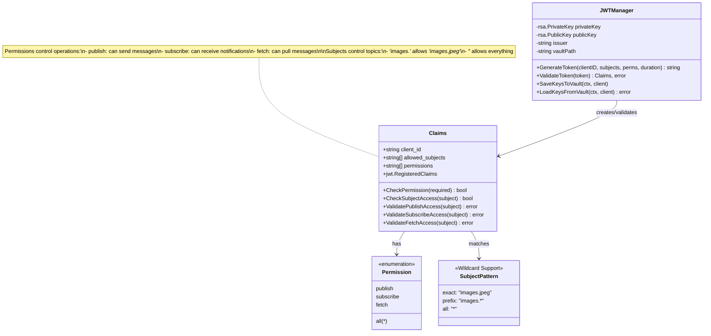

### Vault Secrets Structure

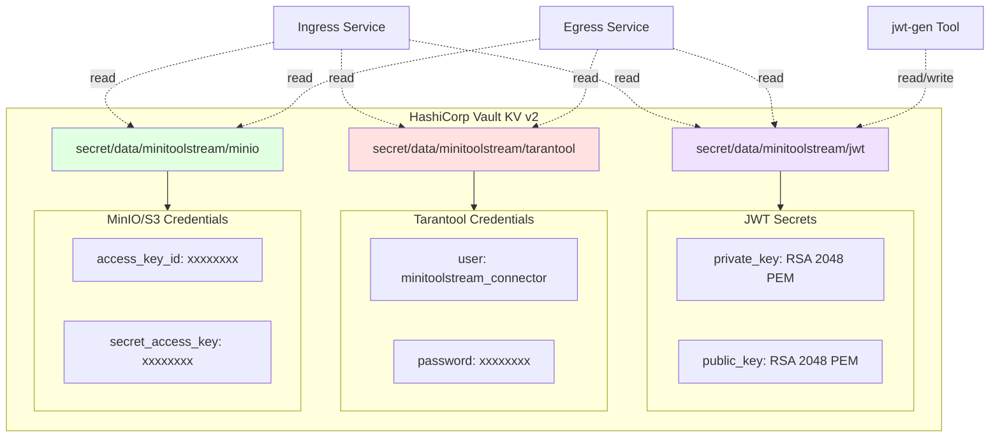

### Service Startup with Vault

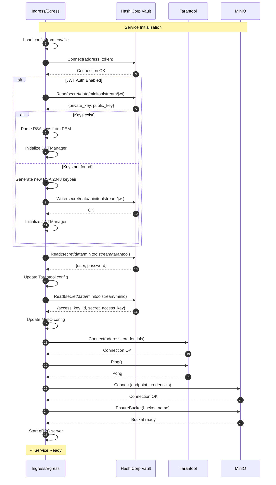

---

### 2.4. Диаграмма последовательности: Publish Flow

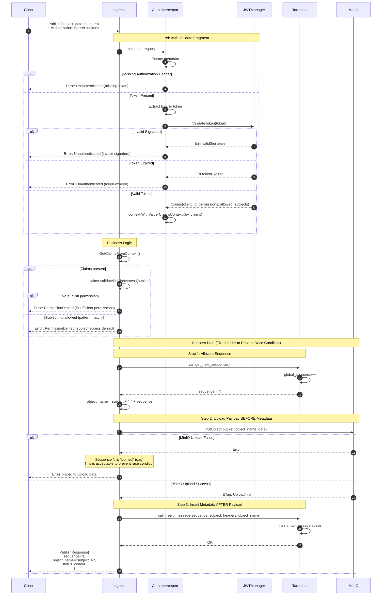

---

### 2.5. Диаграмма последовательности: Subscribe/Fetch Flow

### Subscribe Flow

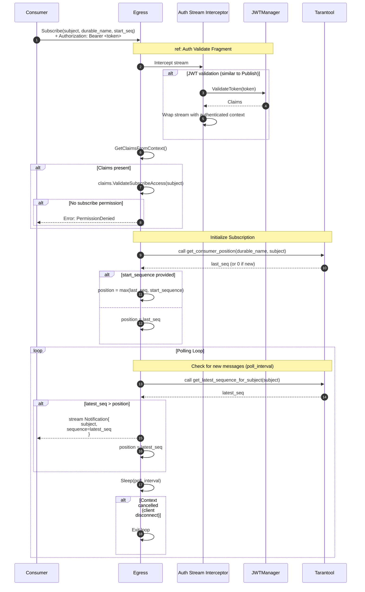

### Fetch Flow with Manual Acknowledgment (At-Least-Once Delivery)

```mermaid
sequenceDiagram
    autonumber
    participant Consumer
    participant Egress
    participant Auth as Auth Stream Interceptor
    participant Tarantool
    participant MinIO

    Consumer->>Egress: Fetch(subject, durable_name, batch_size)<br/>+ Authorization: Bearer <token>

    Note over Egress,Auth: ref: Auth Validate Fragment
    Egress->>Auth: ValidateToken() → Claims

    Egress->>Egress: claims.ValidateFetchAccess(subject)

    alt No fetch permission
        Egress-->>Consumer: Error: PermissionDenied
    end

    Note over Egress,MinIO: Fetch Messages (WITHOUT auto position update)
    Egress->>Tarantool: call get_consumer_position(durable_name, subject)
    Tarantool-->>Egress: last_seq

    Egress->>Egress: start_seq = last_seq + 1
    Egress->>Tarantool: call get_messages_by_subject(subject, start_seq, batch_size)
    Tarantool->>Tarantool: SELECT from message<br/>WHERE subject = ? AND sequence >= ?<br/>LIMIT ?
    Tarantool-->>Egress: messages[] (metadata only)

    loop For each message in batch
        Egress->>Egress: Extract object_name from metadata

        alt object_name is not empty
            Egress->>MinIO: GetObject(bucket, object_name)

            alt MinIO Error (object not found or unavailable)
                MinIO-->>Egress: Error
                Note over Egress: STOP processing batch<br/>DON'T return messages<br/>Client can retry fetch
                Egress-->>Consumer: Error: Failed to fetch payload
                break Abort batch processing
            else MinIO Success
                MinIO-->>Egress: data (payload bytes)
                Egress->>Egress: Merge metadata + data
            end
        end

        Note over Egress: Position is NOT updated here!
        Egress-->>Consumer: stream Message{<br/>  subject, sequence,<br/>  data, headers,<br/>  timestamp<br/>}
    end

    Note over Consumer: Consumer MUST ACK after processing

    loop For each successfully processed message
        Consumer->>Consumer: Process message (save to DB, file, etc.)

        alt Processing successful
            Consumer->>Egress: AckMessage(durable_name, subject, sequence)
            Egress->>Tarantool: call update_consumer_position(durable_name, subject, sequence)
            Tarantool->>Tarantool: UPSERT into consumers
            Tarantool-->>Egress: OK
            Egress-->>Consumer: AckResponse{success: true}
        else Processing failed
            Note over Consumer: DO NOT ACK<br/>Message will be redelivered
        end
    end

    Note over Consumer: If consumer crashes before ACK,<br/>messages will be redelivered (At-Least-Once)
```

---

### 2.6. Диаграмма последовательности: Auth Flow (Universal)

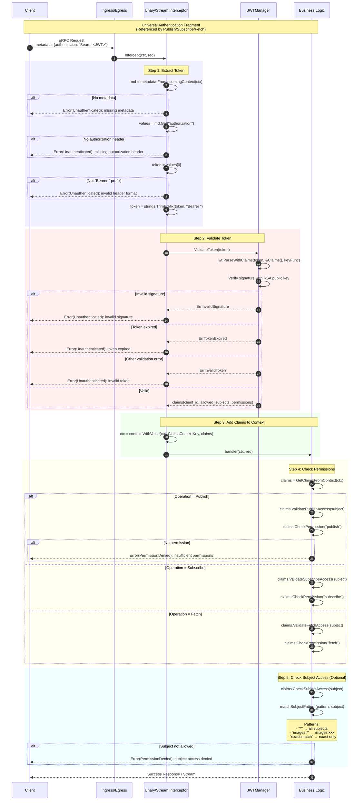

---

### 2.7. Диаграмма развёртывания

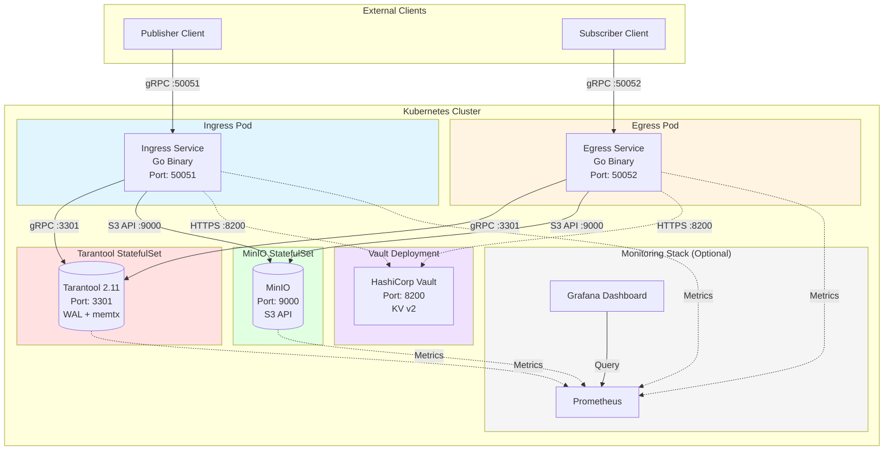

### Deployment Configuration

```yaml
# Tarantool StatefulSet
apiVersion: apps/v1
kind: StatefulSet
metadata:
  name: tarantool
spec:
  serviceName: tarantool
  replicas: 1  # Standalone mode
  template:
    spec:
      containers:
      - name: tarantool
        image: tarantool/tarantool:2.11
        ports:
        - containerPort: 3301
        volumeMounts:
        - name: data
          mountPath: /var/lib/tarantool
        - name: config
          mountPath: /opt/tarantool/init.lua
          subPath: init.lua

---
# MinIO StatefulSet
apiVersion: apps/v1
kind: StatefulSet
metadata:
  name: minio
spec:
  serviceName: minio
  replicas: 1
  template:
    spec:
      containers:
      - name: minio
        image: minio/minio:latest
        args: ["server", "/data"]
        ports:
        - containerPort: 9000

---
# Ingress Service Deployment
apiVersion: apps/v1
kind: Deployment
metadata:
  name: minitoolstream-ingress
spec:
  replicas: 2  # Horizontal scaling
  template:
    spec:
      containers:
      - name: ingress
        image: minitoolstream/ingress:latest
        ports:
        - containerPort: 50051
        env:
        - name: VAULT_ADDR
          value: "http://vault:8200"
        - name: VAULT_TOKEN
          valueFrom:
            secretKeyRef:
              name: vault-token
              key: token

---
# Egress Service Deployment
apiVersion: apps/v1
kind: Deployment
metadata:
  name: minitoolstream-egress
spec:
  replicas: 2  # Horizontal scaling
  template:
    spec:
      containers:
      - name: egress
        image: minitoolstream/egress:latest
        ports:
        - containerPort: 50052
        env:
        - name: VAULT_ADDR
          value: "http://vault:8200"
```

---

### 2.8. Диаграмма компонентов

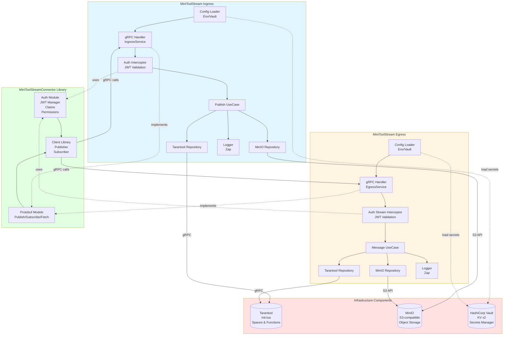

### Component Dependencies

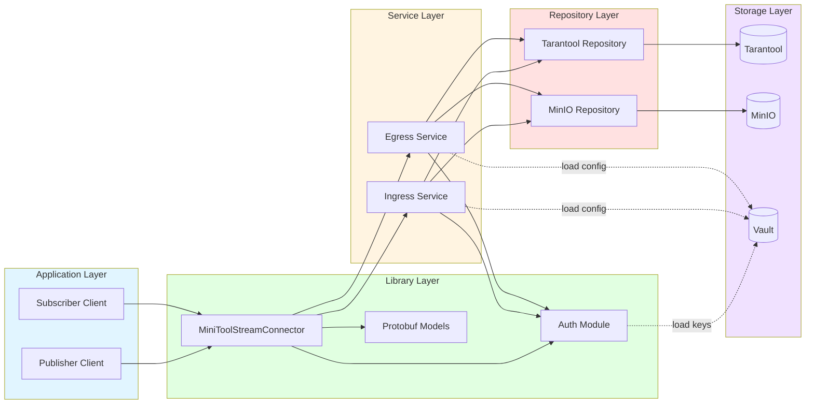

---

## Итоговая таблица компонентов

| Компонент | Технология | Порт | Назначение |
|-----------|-----------|------|------------|
| **MiniToolStream Ingress** | Go 1.24, gRPC | 50051 | Прием сообщений (Publish) |
| **MiniToolStream Egress** | Go 1.24, gRPC | 50052 | Выдача сообщений (Subscribe/Fetch) |
| **Tarantool** | Tarantool 2.11, Lua | 3301 | Хранение метаданных, consumer positions |
| **MinIO** | MinIO (S3-compatible) | 9000 | Хранение payload (больших данных) |
| **HashiCorp Vault** | Vault KV v2 | 8200 | Управление секретами (JWT keys, credentials) |
| **MiniToolStreamConnector** | Go library | N/A | Клиентская библиотека + Auth модуль |
| **Publisher Client** | Go application | N/A | Пример клиента для публикации |
| **Subscriber Client** | Go application | N/A | Пример клиента для подписки |
| **jwt-gen** | Go CLI tool | N/A | Генерация JWT токенов |

---

## Схемы данных

### Tarantool Space: message

| Field | Type | Index | Description |
|-------|------|-------|-------------|
| sequence | uint64 | PRIMARY | Глобальный уникальный ID сообщения |
| headers | any (map) | - | Метаданные сообщения (msgpack) |
| object_name | string | - | Ключ в MinIO: `{subject}_{sequence}` |
| subject | string | subject<br/>subject_sequence | Топик/канал |
| create_at | uint64 | create_at | Unix timestamp для TTL |

### Tarantool Space: consumers

| Field | Type | Index | Description |
|-------|------|-------|-------------|
| durable_name | string | PRIMARY (composite) | Имя consumer group |
| subject | string | PRIMARY (composite)<br/>subject | Подписанный топик |
| last_sequence | uint64 | - | Последний прочитанный sequence |

### Vault Secret Paths

| Path | Fields | Description |
|------|--------|-------------|
| `secret/data/minitoolstream/jwt` | `private_key`, `public_key` | RSA 2048 ключи для JWT |
| `secret/data/minitoolstream/tarantool` | `user`, `password` | Учетные данные Tarantool |
| `secret/data/minitoolstream/minio` | `access_key_id`, `secret_access_key` | Учетные данные MinIO |

---


## 3. Ключевые преимущества

### 3.1. Технологические преимущества

| Аспект | MiniToolStream | Apache Kafka |
|--------|---------------|--------------|
| **Размер сообщений** | Без ограничений (до TB) | До 1MB (настраиваемо до 100MB) |
| **Тип данных** | Любой формат, бинарные объекты | Байтовые массивы |
| **Хранение** | Гибридное (Tarantool + S3) | Файловая система |
| **Масштабирование** | Независимое для метаданных и данных | Партиционирование |
| **Сложность эксплуатации** | Средняя | Высокая |

### 3.2. Бизнес-преимущества

- Унифицированное решение для любых типов данных (события, файлы, видео, логи)
- Снижение стоимости хранения за счет использования S3
- Упрощение архитектуры (не нужны отдельные системы для больших файлов)
- Гибкость в выборе стратегий хранения и очистки данных

---


## 4. Архитектура системы

### 4.1. Общая архитектура

```
┌──────────────────┐
│   Producers      │  (Publisher Clients)
│  (Клиенты)       │
└────────┬─────────┘
         │ gRPC
         ▼
┌─────────────────────────────────────────┐
│      MiniToolStream Platform            │
│                                          │
│  ┌────────────────────────────────────┐ │
│  │   MiniToolStreamIngress            │ │
│  │   (Точка входа - gRPC Server)     │ │
│  └──────────┬───────────┬─────────────┘ │
│             │           │                │
│             ▼           ▼                │
│      ┌──────────┐  ┌──────────┐        │
│      │Tarantool │  │  MinIO   │        │
│      │(metadata)│  │  (data)  │        │
│      └──────────┘  └──────────┘        │
│             ▲           ▲                │
│             │           │                │
│  ┌──────────┴───────────┴─────────────┐ │
│  │   MiniToolStreamEgress             │ │
│  │   (Точка выхода - gRPC Server)    │ │
│  └────────────────────────────────────┘ │
│                                          │
└───────────────┬──────────────────────────┘
                │ gRPC
                ▼
┌──────────────────┐
│   Consumers      │  (Subscriber Clients)
│  (Клиенты)       │
└──────────────────┘
```

### 4.2. Компоненты системы

#### 4.2.1. MiniToolStreamIngress (Точка входа)

**Назначение:** Прием и обработка входящих сообщений от производителей.

**Функции:**
- Прием gRPC запросов на публикацию сообщений
- Валидация входящих данных
- Генерация уникальных идентификаторов (sequence)
- Сохранение метаданных в Tarantool
- Загрузка полезной нагрузки в MinIO
- Возврат подтверждения публикации клиенту

**Технологии:**
- Язык: Go 1.21+
- Протокол: gRPC
- Порт: 50051 (настраиваемый)

**Масштабирование:** Горизонтальное (stateless сервис)

#### 4.2.2. MiniToolStreamEgress (Точка выхода)

**Назначение:** Предоставление доступа к опубликованным сообщениям потребителям.

**Функции:**
- Прием gRPC запросов на чтение сообщений
- Получение последнего доступного sequence по каналу
- Извлечение метаданных из Tarantool
- Загрузка данных из MinIO
- Управление позицией чтения для durable consumers
- Поддержка стриминга сообщений

**Технологии:**
- Язык: Go 1.21+
- Протокол: gRPC (unary + server streaming)
- Порт: 50052 (настраиваемый)

**Масштабирование:** Горизонтальное (stateless сервис)

#### 4.2.3. Tarantool (Хранилище метаданных)

**Назначение:** Высокопроизводительное хранение метаданных сообщений.

**Структура данных:**

**Space: message**
```lua
{
    sequence: unsigned,      -- Глобальный уникальный номер сообщения (PK)
    headers: map,            -- Заголовки сообщения (метаданные)
    object_name: string,     -- Ключ объекта в MinIO (subject_sequence)
    subject: string,         -- Название канала/топика
    create_at: unsigned      -- Timestamp создания (для TTL)
}
```

**Индексы:**
- PRIMARY: sequence (unique)
- SECONDARY: subject (non-unique)
- SECONDARY: subject_sequence (unique, composite)
- SECONDARY: create_at (non-unique, для TTL)

**Space: consumers**
```lua
{
    durable_name: string,    -- Имя durable consumer
    subject: string,         -- Подписанный канал
    last_sequence: unsigned  -- Последний прочитанный sequence
}
```

**Индексы:**
- PRIMARY: (durable_name, subject) (composite unique)
- SECONDARY: subject (non-unique)

**Параметры:**
- Версия: Tarantool 2.11+
- Движок: memtx (in-memory с WAL)
- Память: 1GB (настраиваемо)
- WAL: включен (write mode)
- Репликация: standalone (1 нода)

#### 4.2.4. MinIO (Хранилище данных)

**Назначение:** Масштабируемое S3-совместимое хранилище полезной нагрузки сообщений.

**Параметры:**
- Bucket: `minitoolstream`
- Naming convention: `{subject}_{sequence}`
- Access: через SDK (MinIO Go Client)
- Политика доступа: private (только через API)

**Версия:** MinIO Latest (S3-compatible)

#### 4.2.5. HashiCorp Vault (Управление секретами)

**Назначение:** Централизованное управление конфигурацией и секретами.

**Хранимые секреты:**
- Credentials Tarantool
- Credentials MinIO
- API keys для сервисов
- TLS сертификаты

**Режим:** Development (для dev), HA (для production)

#### 4.2.6. MiniToolStreamConnector (Клиентская библиотека)

**Назначение:** SDK для упрощения интеграции с платформой.

**Функции:**
- Publisher API (публикация сообщений)
- Subscriber API (чтение сообщений)
- Управление подключением
- Автоматический retry при ошибках
- Logging и monitoring

**Архитектура:** Clean Architecture
```
minitoolstream_connector/
├── publisher.go          # Publisher API
├── subscriber.go         # Subscriber API
├── infrastructure/       # Реализации
│   ├── grpc_client/     # gRPC клиент
│   └── handler/         # Обработчики разных типов данных
└── domain/              # Domain entities
```

---


## 5. Поток данных (Data Flow)

### 5.1. Публикация сообщений (Publish Flow)

**ВАЖНО: Порядок операций критичен для предотвращения race conditions!**

```
1. Producer ──[PublishRequest]──> MiniToolStreamIngress
                                         │
2. Validate request (subject not empty)  │
                                         │
3. Allocate sequence number             ↓
   sequence = get_next_sequence()   [Tarantool]
                                         │
4. Generate object_key                  │
   object_key = "{subject}_{sequence}"   │
                                         │
5. Upload to MinIO FIRST                ↓
   MinIO.Put(object_key, data)      [MinIO]
                                         │
   ┌─ if MinIO fails ──────────────────┐
   │  sequence is "burned" (gap)        │
   │  return error to client            │
   │  (acceptable to prevent race)      │
   └────────────────────────────────────┘
                                         │
6. Insert metadata to Tarantool AFTER  ↓
   insert_message(seq, subject,     [Tarantool]
                  headers, object_name)
                                         │
7. Response ←──[PublishResponse]────────┘
   {sequence, object_name, status}
```

**Детали:**
1. **Валидация:** Проверка обязательных полей (subject)
2. **Sequence allocation:** Атомарный инкремент глобального счетчика в Tarantool
3. **Порядок операций (критично!):**
   - **Шаг 1:** Выделить sequence (`get_next_sequence()`)
   - **Шаг 2:** Загрузить payload в MinIO с ключом `{subject}_{sequence}`
   - **Шаг 3:** Вставить metadata в Tarantool (`insert_message()`)
   - **Причина:** Если metadata появится в Tarantool ДО загрузки в MinIO, subscriber может попытаться прочитать несуществующий объект → race condition
4. **Обработка ошибок:**
   - Если MinIO недоступен, sequence "сжигается" (gap в последовательности)
   - Это **допустимый компромисс** для предотвращения race condition
   - Subscribers должны обрабатывать пропуски в sequence
5. **Ответ:** Возврат sequence и object_name клиенту

**Гарантии:**
- **At-least-once delivery**: Сообщение гарантированно сохранено в обоих хранилищах
- **No race conditions**: Payload всегда доступен до появления metadata
- **Ordering**: Глобальный порядок через sequence (с возможными gaps)
- **Durability**: WAL в Tarantool + репликация MinIO

**Компромиссы:**
- **Gaps in sequence**: При сбое MinIO sequence теряется (gap)
  - Это предпочтительнее, чем race condition
  - Subscribers должны быть устойчивы к пропускам
- **Orphaned objects**: При сбое Tarantool после загрузки в MinIO объект остается без metadata
  - TTL cleanup удалит orphaned objects через заданный интервал

### 5.2. Потребление сообщений (Subscribe Flow)

**Модель:** Pull-based (потребитель запрашивает сообщения)

```
1. Consumer ──[GetLatestSequence]──> MiniToolStreamEgress
                                            │
2. Query Tarantool                         │
   latest = get_latest_sequence(subject)   │
                                           ↓
3. Response ←──[LatestSequenceResponse]───┘
   {latest_sequence}

4. Consumer compares with local position
   new_messages = latest - consumer_position

5. Consumer ──[FetchRequest]──> MiniToolStreamEgress
   {subject, start_sequence, limit}
                                            │
6. Fetch metadata from Tarantool          │
   messages = get_messages_by_subject()    │
                                           ↓
7. For each message:                  [Tarantool]
   - Get metadata (object_name)            │
   - Fetch data from MinIO                 │
   - object = MinIO.Get(object_name)       │
                                           ↓
   ┌─ if MinIO fails ──────────────────┐ [MinIO]
   │  STOP batch processing             │
   │  DON'T update consumer position    │
   │  return error to client            │
   │  (client can retry fetch)          │
   └────────────────────────────────────┘
                                           │
8. Stream messages ←────────────────  [MinIO]
   [MessageResponse] (multiple)

9. Update consumer position (ONLY after successful fetch)
   update_consumer_position(durable, subject, last_seq)
```

**ВАЖНО: Обработка ошибок при Fetch:**
- Если не удается загрузить payload из MinIO, обработка батча **прерывается**
- Consumer position **НЕ обновляется**
- Клиент получает ошибку и может повторить запрос
- Это предотвращает **безвозвратную потерю сообщений**

**Режимы потребления:**

**A. Durable Consumer (с сохранением позиции)**
```go
Subscribe(subject, durable_name) → stream of messages
```
- Позиция читается из Tarantool (space: consumers)
- Автоматически обновляется после обработки
- Позволяет продолжить с последнего прочитанного

**B. Ephemeral Consumer (без сохранения)**
```go
Fetch(subject, start_sequence, limit) → batch of messages
```
- Клиент сам управляет позицией
- Нет записи в Tarantool
- Используется для одноразовых запросов

### 5.3. Очистка данных (TTL Cleanup)

**Компонент:** MiniToolStreamCleaner (отдельный сервис, опционально)

```
1. Periodic check (e.g., every hour)
                │
2. Query Tarantool                     ↓
   old_messages = delete_old_messages(ttl) [Tarantool]
                                            │
3. For each deleted message:              │
   - Delete from MinIO                     │
   MinIO.Delete(object_name)               ↓
                                       [MinIO]
4. Log deleted count
```

**Параметры:**
- `TTL`: Время жизни сообщений (настраивается per-subject или глобально)
- `CHECK_INTERVAL`: Интервал проверки (по умолчанию 1 час)

---


## 6. API спецификация

### 6.1. Ingress gRPC API

**Service:** `IngressService`

#### 6.1.1. Publish RPC

Публикация одного сообщения.

**Request:**
```protobuf
message PublishRequest {
  string subject = 1;                    // Название канала (обязательно)
  bytes data = 2;                        // Полезная нагрузка (опционально, может быть пустым)
  map<string, string> headers = 3;       // Метаданные сообщения
}
```

**Response:**
```protobuf
message PublishResponse {
  uint64 sequence = 1;                   // Уникальный номер сообщения
  string object_name = 2;                // Ключ объекта в MinIO
  int64 status_code = 3;                 // 0 = success, != 0 = error
  string error_message = 4;              // Описание ошибки (если есть)
}
```

**Примеры:**
```bash
# Успешная публикация
Request: {subject: "orders.created", data: "order_123", headers: {"content-type": "text/plain"}}
Response: {sequence: 12345, object_name: "orders.created_12345", status_code: 0}

# Ошибка валидации
Request: {subject: "", data: "test"}
Response: {status_code: 1, error_message: "subject cannot be empty"}
```

#### 6.1.2. PublishBatch RPC (будущая функциональность)

Публикация пакета сообщений за один запрос.

**Request:**
```protobuf
message PublishBatchRequest {
  repeated PublishRequest messages = 1;
}
```

**Response:**
```protobuf
message PublishBatchResponse {
  repeated PublishResponse results = 1;
  int64 total_count = 2;
  int64 success_count = 3;
  int64 error_count = 4;
}
```

### 6.2. Egress gRPC API

**Service:** `EgressService`

#### 6.2.1. GetLatestSequence RPC

Получение последнего доступного sequence для канала.

**Request:**
```protobuf
message GetLatestSequenceRequest {
  string subject = 1;                    // Название канала
}
```

**Response:**
```protobuf
message GetLatestSequenceResponse {
  uint64 latest_sequence = 1;            // Последний sequence (0 если нет сообщений)
  int64 status_code = 2;
  string error_message = 3;
}
```

#### 6.2.2. Fetch RPC

Получение пакета сообщений по sequence.

**Request:**
```protobuf
message FetchRequest {
  string subject = 1;                    // Название канала
  uint64 start_sequence = 2;             // Начальный sequence (включительно)
  int32 limit = 3;                       // Максимальное количество сообщений
}
```

**Response:**
```protobuf
message FetchResponse {
  repeated Message messages = 1;
  int64 status_code = 2;
  string error_message = 3;
}

message Message {
  uint64 sequence = 1;
  string subject = 2;
  bytes data = 3;
  map<string, string> headers = 4;
  uint64 create_at = 5;
}
```

#### 6.2.3. Subscribe RPC (Server Streaming)

Подписка на канал с автоматическим получением новых сообщений.

**Request:**
```protobuf
message SubscribeRequest {
  string subject = 1;                    // Название канала
  string durable_name = 2;               // Имя durable consumer (опционально)
  uint64 start_sequence = 3;             // Начальная позиция (опционально)
  int32 batch_size = 4;                  // Размер пакета (по умолчанию 10)
}
```

**Response:** (stream)
```protobuf
message SubscribeResponse {
  oneof response_type {
    MessageBatch batch = 1;              // Пакет сообщений
    Notification notification = 2;        // Уведомление о новых сообщениях
    Error error = 3;                     // Ошибка
  }
}

message MessageBatch {
  repeated Message messages = 1;
}

message Notification {
  uint64 latest_sequence = 1;            // Последний доступный sequence
  int32 new_messages_count = 2;          // Количество новых сообщений
}
```

**Логика работы:**
1. Клиент отправляет SubscribeRequest
2. Сервер возвращает начальный пакет сообщений
3. Сервер периодически проверяет наличие новых сообщений
4. При появлении новых - отправляет Notification
5. Клиент запрашивает следующий пакет
6. Цикл повторяется до закрытия stream

#### 6.2.4. AckMessage RPC

Подтверждение успешной обработки сообщения (Manual Acknowledgment для At-Least-Once delivery).

**Request:**
```protobuf
message AckRequest {
  string durable_name = 1;              // Имя durable consumer
  string subject = 2;                    // Название канала
  uint64 sequence = 3;                   // Sequence обработанного сообщения
}
```

**Response:**
```protobuf
message AckResponse {
  bool success = 1;                      // true если ACK успешен
  string error_message = 2;              // Сообщение об ошибке (если success = false)
}
```

**Важно:**
- Consumer **ДОЛЖЕН** вызывать `AckMessage` после успешной обработки каждого сообщения
- Если ACK не отправлен (consumer упал), сообщение будет доставлено повторно
- Это обеспечивает гарантию **At-Least-Once delivery**

### 6.3. Клиентская библиотека API (Go SDK)

#### 6.3.1. Publisher API

```go
// Создание publisher
publisher, err := minitoolstream.NewPublisher(serverAddr string) (*Publisher, error)

// С дополнительными параметрами
publisher, err := minitoolstream.NewPublisherBuilder(serverAddr).
    WithTimeout(10 * time.Second).
    WithRetry(3).
    WithLogger(logger).
    Build()

// Публикация сообщения
result, err := publisher.Publish(ctx, &Message{
    Subject: "orders.created",
    Data:    data,
    Headers: map[string]string{
        "content-type": "application/json",
        "source": "order-service",
    },
})

// Публикация файла
result, err := publisher.PublishFile(ctx, "documents.pdf", "/path/to/file.pdf")

// Публикация изображения
result, err := publisher.PublishImage(ctx, "images.jpeg", "/path/to/image.jpg")

// Закрытие
publisher.Close()
```

#### 6.3.2. Subscriber API

```go
// Создание subscriber
subscriber, err := minitoolstream.NewSubscriber(serverAddr, durableName)

// Подписка на канал с обработчиком (автоматический ACK)
err = subscriber.Subscribe(ctx, "orders.created", func(msg *Message) error {
    // Обработка сообщения
    log.Printf("Received: %s", string(msg.Data))

    // Если handler возвращает nil, subscriber автоматически вызывает ACK
    // При ошибке ACK не отправляется - сообщение будет доставлено повторно
    return nil
})

// Получение пакета сообщений с ручным ACK
messages, err := subscriber.Fetch(ctx, "orders.created", startSeq, 100)
for _, msg := range messages {
    // Обработка сообщения
    if err := processMessage(msg); err != nil {
        log.Printf("Failed to process: %v", err)
        continue // НЕ отправляем ACK - сообщение будет доставлено повторно
    }

    // Подтверждаем успешную обработку (At-Least-Once delivery)
    if err := subscriber.AckMessage(ctx, "orders.created", msg.Sequence); err != nil {
        log.Printf("Failed to ACK: %v", err)
    }
}

// Получение последнего sequence
latest, err := subscriber.GetLatestSequence(ctx, "orders.created")

// Остановка
subscriber.Stop()
```

---


## 7. Функциональные требования

| ID | Требование | Описание | Приоритет |
|----|-----------|----------|-----------|
| **ФТ-1** | Прием сообщений | Система должна принимать сообщения от производителей через gRPC API | Критический |
| **ФТ-2** | Доставка сообщений | Система должна предоставлять API для чтения сообщений по sequence | Критический |
| **ФТ-3** | Поддержка каналов (Topics) | Система должна поддерживать множество независимых каналов | Критический |
| **ФТ-4** | Множество потребителей | Один канал может читаться неограниченным числом потребителей | Критический |
| **ФТ-5** | Durable consumers | Поддержка сохранения позиции чтения для consumer groups | Высокий |
| **ФТ-6** | Управление жизненным циклом | Автоматическое удаление устаревших данных по TTL | Высокий |
| **ФТ-7** | Клиентская библиотека | SDK на Go для упрощения интеграции | Высокий |
| **ФТ-8** | Гибкость формата данных | Поддержка любых форматов данных без ограничений | Критический |
| **ФТ-9** | Batch публикация | Возможность публиковать несколько сообщений за один запрос | Средний |
| **ФТ-10** | Streaming подписка | Server-side streaming для real-time доставки | Высокий |
| **ФТ-11** | Мониторинг и метрики | Экспорт метрик производительности (Prometheus) | Средний |
| **ФТ-12** | Логирование | Структурированное логирование всех операций | Высокий |
| **ФТ-13** | Health checks | Проверки здоровья сервисов для Kubernetes | Высокий |
| **ФТ-14** | Graceful shutdown | Корректная остановка с завершением активных запросов | Высокий |
| **ФТ-15** | Документация API | Полная документация всех API endpoints | Высокий |

---


## 8. Нефункциональные требования

### 8.1. Производительность

| ID | Требование | Описание | Метрика |
|----|-----------|----------|---------|
| **НФТ-1** | Throughput (Ingress) | Система должна обрабатывать минимум 1000 RPS на публикацию | >= 1000 RPS |
| **НФТ-2** | Latency (Ingress) | Задержка публикации сообщения до 10KB | p95 < 50ms |
| **НФТ-3** | Latency (Egress) | Задержка чтения сообщения | p95 < 100ms |
| **НФТ-4** | Throughput (Egress) | Система должна обрабатывать минимум 500 RPS на чтение | >= 500 RPS |
| **НФТ-5** | Размер сообщения | Поддержка сообщений до 1GB без деградации | 1GB max |
| **НФТ-6** | Concurrent connections | Поддержка минимум 1000 одновременных соединений | >= 1000 |

### 8.2. Надежность

| ID | Требование | Описание |
|----|-----------|----------|
| **НФТ
├── Namespace: minitoolstream
│   ├── Deployment: minitoolstream-ingress (3 replicas)
│   │   └── Service: ClusterIP (port 50051)
│   ├── Deployment: minitoolstream-egress (3 replicas)
│   │   └── Service: ClusterIP (port 50052)
│   ├── StatefulSet: tarantool (1 replica)
│   │   ├── Service: ClusterIP (port 3301)
│   │   └── PersistentVolumeClaim (10Gi)
│   ├── StatefulSet: minio (4 replicas)
│   │   ├── Service: ClusterIP (port 9000)
│   │   └── PersistentVolumeClaim (100Gi per node)
│   └── Deployment: vault (1 replica)
│       └── Service: ClusterIP (port 8200)
│
├── ConfigMaps:
│   ├── ingress-config
│   ├── egress-config
│   └── tarantool-config
│
├── Secrets:
│   ├── tarantool-credentials
│   ├── minio-credentials
│   └── vault-token
│
└── HorizontalPodAutoscaler:
├── ingress-hpa (min: 3, max: 10)
└── egress-hpa (min: 3, max: 10)
```

### 8.3. Процесс развертывания

#### 8.3.1. Локальное развертывание (Development)

**Шаг 1: Запуск инфраструктуры**
```bash
# Docker Compose для Tarantool, MinIO, Vault
cd MiniToolStream
docker-compose up -d
```

**Шаг 2: Создание k3d кластера**
```bash
k3d cluster create minitoolstream \
  --agents 2 \
  --api-port 6550 \
  --port "8080:80@loadbalancer" \
  --port "8443:443@loadbalancer"
```

**Шаг 3: Развертывание Dashboard**
```bash
helm install kubernetes-dashboard kubernetes-dashboard/kubernetes-dashboard \
  --create-namespace \
  --namespace kubernetes-dashboard
```

**Шаг 4: Сборка образов**
```bash
# Ingress
cd MiniToolStreamIngress
docker build -t minitoolstream-ingress:latest --platform linux/arm64 .
k3d image import minitoolstream-ingress:latest -c minitoolstream

# Egress
cd MiniToolStreamEgress
docker build -t minitoolstream-egress:latest --platform linux/arm64 .
k3d image import minitoolstream-egress:latest -c minitoolstream
```

**Шаг 5: Развертывание сервисов**
```bash
# Ingress
kubectl apply -k MiniToolStreamIngress/k8s/

# Egress
kubectl apply -k MiniToolStreamEgress/k8s/

# Создание ExternalName сервисов для Tarantool и MinIO
kubectl apply -f infrastructure-services.yaml
```

**Шаг 6: Проверка**
```bash
kubectl get all -n minitoolstream
kubectl logs -n minitoolstream -l app=minitoolstream-ingress
```

#### 8.3.2. Production развертывание

**Шаг 1: Подготовка окружения**
```bash
# Создание namespace
kubectl create namespace minitoolstream

# Установка Tarantool Operator
kubectl apply -f https://raw.githubusercontent.com/tarantool/tarantool-operator/master/deploy/bundle.yaml

# Установка MinIO Operator
kubectl apply -k github.com/minio/operator
```

**Шаг 2: Настройка секретов**
```bash
# Vault
helm install vault hashicorp/vault \
  --namespace minitoolstream \
  --set server.ha.enabled=true \
  --set server.ha.replicas=3

# Заполнение секретов
kubectl create secret generic tarantool-credentials \
  --from-literal=user=minitoolstream_connector \
  --from-literal=password=<strong-password> \
  -n minitoolstream

kubectl create secret generic minio-credentials \
  --from-literal=accessKey=<access-key> \
  --from-literal=secretKey=<secret-key> \
  -n minitoolstream
```

**Шаг 3: Развертывание Tarantool**
```bash
kubectl apply -f tarantool-cluster.yaml
```

**Шаг 4: Развертывание MinIO**
```bash
kubectl apply -f minio-tenant.yaml
```

**Шаг 5: Развертывание приложений**
```bash
# Через Helm Chart
helm install minitoolstream ./charts/minitoolstream \
  --namespace minitoolstream \
  --values production-values.yaml
```

**Шаг 6: Настройка мониторинга**
```bash
# Prometheus
helm install prometheus prometheus-community/kube-prometheus-stack \
  --namespace monitoring

# Grafana dashboards
kubectl apply -f monitoring/grafana-dashboards/
```

### 8.4. Конфигурационные файлы

#### 8.4.1. Ingress ConfigMap

```yaml
apiVersion: v1
kind: ConfigMap
metadata:
  name: minitoolstream-ingress-config
  namespace: minitoolstream
data:
  config.yaml: |
    server:
      port: 50051
      grpc:
        max_concurrent_streams: 1000
        max_connection_idle: 5m

    tarantool:
      address: "tarantool-service:3301"
      user: "minitoolstream_connector"
      timeout: 5s
      pool_size: 10

    minio:
      endpoint: "minio-service:9000"
      bucket: "minitoolstream"
      use_ssl: false

    vault:
      enabled: true
      address: "http://vault:8200"
      secrets_path: "minitoolstream/ingress"

    logging:
      level: info
      format: json
```

#### 8.4.2. Egress ConfigMap

```yaml
apiVersion: v1
kind: ConfigMap
metadata:
  name: minitoolstream-egress-config
  namespace: minitoolstream
data:
  config.yaml: |
    server:
      port: 50052
      grpc:
        max_concurrent_streams: 1000
        keepalive: 30s

    tarantool:
      address: "tarantool-service:3301"
      user: "minitoolstream_connector"
      timeout: 5s
      pool_size: 20

    minio:
      endpoint: "minio-service:9000"
      bucket: "minitoolstream"
      use_ssl: false

    subscription:
      check_interval: 1s
      batch_size: 10
      max_wait_time: 30s

    logging:
      level: info
      format: json
```

### 8.5. Docker образы

#### 8.5.1. Ingress Dockerfile

```dockerfile
# Build stage
FROM golang:1.21-alpine AS builder

RUN apk add --no-cache git ca-certificates tzdata

WORKDIR /app
COPY go.mod go.sum ./
RUN go mod download

COPY . .
RUN CGO_ENABLED=0 GOOS=linux GOARCH=amd64 go build \
    -ldflags="-w -s" \
    -o /app/minitoolstream-ingress \
    ./cmd/server

# Runtime stage
FROM alpine:latest

RUN apk --no-cache add ca-certificates tzdata
RUN addgroup -g 1000 appgroup && \
    adduser -D -u 1000 -G appgroup appuser

WORKDIR /app
COPY --from=builder /app/minitoolstream-ingress .

RUN chown -R appuser:appgroup /app
USER appuser

EXPOSE 50051

ENTRYPOINT ["/app/minitoolstream-ingress"]
```

### 8.6. Мониторинг и Observability

#### 8.6.1. Метрики (Prometheus)

**Ingress метрики:**
```
minitoolstream_ingress_requests_total{status}
minitoolstream_ingress_request_duration_seconds
minitoolstream_ingress_active_connections
minitoolstream_ingress_tarantool_operations_total{operation, status}
minitoolstream_ingress_minio_operations_total{operation, status}
```

**Egress метрики:**
```
minitoolstream_egress_requests_total{method, status}
minitoolstream_egress_request_duration_seconds
minitoolstream_egress_active_subscriptions
minitoolstream_egress_messages_delivered_total
```

#### 8.6.2. Health Checks

**Liveness Probe:**
```yaml
livenessProbe:
  exec:
    command:
      - /bin/sh
      - -c
      - "nc -z localhost 50051"
  initialDelaySeconds: 30
  periodSeconds: 10
```

**Readiness Probe:**
```yaml
readinessProbe:
  exec:
    command:
      - /bin/sh
      - -c
      - "nc -z localhost 50051"
  initialDelaySeconds: 10
  periodSeconds: 5
```

---

```

## 9. Технологический стек

### 9.1. Основные технологии

| Компонент | Технология | Версия | Назначение |
|-----------|-----------|--------|------------|
| **Язык программирования** | Go (Golang) | 1.21+ | Разработка всех сервисов |
| **RPC протокол** | gRPC | 1.50+ | Межсервисное взаимодействие |
| **Метаданные БД** | Tarantool | 2.11+ | In-memory хранилище метаданных |
| **Объектное хранилище** | MinIO | Latest | S3-compatible хранилище данных |
| **Секреты** | HashiCorp Vault | Latest | Управление конфигурацией и секретами |
| **Оркестрация** | Kubernetes | 1.25+ | Развертывание и управление |
| **Контейнеризация** | Docker | Latest | Упаковка приложений |
| **Registry** | Docker Hub | - | Хранение образов |

### 9.2. Вспомогательные инструменты

| Инструмент | Назначение |
|-----------|-----------|
| **Protocol Buffers** | Определение gRPC API |
| **Tarantool Operator** | Управление кластером Tarantool в K8s |
| **MinIO Operator** | Управление MinIO в K8s |
| **Helm** | Package manager для K8s |
| **Prometheus** | Сбор метрик |
| **Grafana** | Визуализация метрик |
| **Loki** | Агрегация логов |

### 9.3. Go библиотеки

```go
// gRPC и protobuf
google.golang.org/grpc
google.golang.org/protobuf

// Tarantool client
github.com/tarantool/go-tarantool

// MinIO client
github.com/minio/minio-go/v7

// Vault client
github.com/hashicorp/vault/api

// Логирование
go.uber.org/zap

// Конфигурация
github.com/spf13/viper

// Метрики
github.com/prometheus/client_golang
```

---


## 10. Развертывание

### 10.1. Требования к инфраструктуре

#### 10.1.1. Минимальные требования (Development)

**Одна нода:**
- CPU: 4 cores
- RAM: 8 GB
- Disk: 50 GB SSD
- Network: 1 Gbps

**Kubernetes:**
- k3s (для локальной разработки)
- kubectl

#### 10.1.2. Рекомендуемые требования (Production)

**Kubernetes кластер:**
- Минимум 3 ноды (master + 2 workers)
- CPU: 8 cores per node
- RAM: 16 GB per node
- Disk: 200 GB NVMe SSD per node
- Network: 10 Gbps

**Компоненты:**
- Ingress: 3 реплики
- Egress: 3 реплики
- Tarantool: 1 нода (3 для HA)
- MinIO: 4 ноды (распределенный режим)

### 10.2. Схема развертывания

```
Kubernetes Cluster```

## 11. Ограничения и допущения

### 11.1. Ограничения

1. **Операционные системы:**
    - Production: Linux (Ubuntu 20.04+, RHEL 8+, Debian 11+)
    - Development: Linux, macOS (Apple Silicon)
    - Архитектуры: amd64, arm64

2. **Сетевые требования:**
    - Минимальная пропускная способность: 1 Gbps
    - Задержка между нодами: < 10ms (LAN)
    - Открытые порты: 50051, 50052, 3301, 9000, 8200

3. **Отказоустойчивость:**
    - Single point of failure: Tarantool (в базовой конфигурации)
    - Требуется внешнее решение для резервного копирования
    - RPO (Recovery Point Objective): 5 минут
    - RTO (Recovery Time Objective): 5 минут

4. **Масштабирование:**
    - Вертикальное масштабирование Tarantool ограничено размером RAM
    - Горизонтальное масштабирование Tarantool требует настройки репликации
    - Максимальное количество каналов: не ограничено
    - Максимальное количество потребителей: не ограничено

5. **Размеры данных:**
    - Рекомендуемый максимум для одного сообщения: 1 GB
    - Максимальное количество сообщений: ограничено дисковым пространством MinIO

6. **Гарантии доставки и порядок сообщений:**
    - **Gaps in Sequence (пропуски в последовательности):**
      - При сбое MinIO во время публикации sequence может быть "сожжен"
      - Subscribers должны быть устойчивы к пропускам в sequence
      - Компромисс принят для предотвращения race conditions
      - Пример: sequence может быть 1, 2, 3, 5, 6 (пропущена 4)

    - **Orphaned Objects (осиротевшие объекты):**
      - При сбое Tarantool после загрузки в MinIO объект остается без metadata
      - TTL cleanup автоматически удалит такие объекты
      - Время жизни orphaned objects = TTL для соответствующего subject

    - **At-Least-Once Delivery with Manual Acknowledgment:**
      - Гарантируется At-Least-Once delivery через механизм manual ACK
      - Consumer ДОЛЖЕН явно вызывать `AckMessage` после успешной обработки
      - Если consumer не отправил ACK (crash, network failure), сообщение будет доставлено повторно
      - При ретраях возможна дублирование сообщений
      - Consumers должны быть идемпотентными

    - **Consumer Position Management:**
      - Позиция consumer обновляется ТОЛЬКО при вызове `AckMessage`
      - Если Fetch прерывается из-за ошибки MinIO, позиция НЕ обновляется
      - Если consumer получил сообщения но упал до ACK, сообщения будут доставлены повторно
      - Client может повторить запрос и получить те же сообщения
      - ACK может быть отправлен для каждого сообщения отдельно или батчами

### 11.2. Допущения

1. **Инфраструктура:**
    - У пользователей есть подготовленный Kubernetes кластер
    - Доступны persistent volumes для хранения данных
    - Настроен ingress controller для внешнего доступа

2. **Железо:**
    - Ноды оснащены NVMe SSD для высокой производительности I/O
    - Достаточный объем RAM для работы Tarantool (минимум 8GB)
    - Стабильное сетевое соединение между нодами

3. **Пользователи:**
    - Пользователи являются профессионально подготовленными разработчиками
    - Знание Go, gRPC, Kubernetes на базовом уровне
    - Понимание принципов работы message brokers

4. **Эксплуатация:**
    - Наличие команды DevOps для поддержки инфраструктуры
    - Настроены процедуры резервного копирования и восстановления
    - Есть план реагирования на инциденты

---


## 12. Тестирование

### 12.1. Виды тестирования

| Тип | Описание | Инструменты |
|-----|----------|-------------|
| **Unit tests** | Тестирование отдельных функций и модулей | Go testing, testify |
| **Integration tests** | Тестирование взаимодействия компонентов | Go testing, testcontainers |
| **Load tests** | Нагрузочное тестирование | k6, vegeta |
| **Stress tests** | Тестирование предельных нагрузок | k6 |
| **E2E tests** | End-to-end сценарии | Go testing |
| **Security tests** | Проверка безопасности | gosec, trivy |

### 12.2. Сценарии тестирования

#### 12.2.1. Функциональные тесты

**Сценарий 1: Публикация и чтение сообщения**
```
1. Publisher публикует сообщение в канал "test.channel"
2. Проверка: получен sequence и object_name
3. Subscriber читает последний sequence
4. Subscriber запрашивает сообщение по sequence
5. Проверка: полученные данные совпадают с опубликованными
```

**Сценарий 2: Множество потребителей**
```
1. Publisher публикует 100 сообщений в канал
2. Запускаются 10 Subscribers (durable consumers)
3. Каждый читает все 100 сообщений
4. Проверка: все получили все сообщения
5. Проверка: позиции сохранены в Tarantool
```

**Сценарий 3: TTL и очистка данных**
```
1. Публикация сообщений с TTL = 1 час
2. Ожидание 1 час + 5 минут
3. Запуск cleaner
4. Проверка: старые сообщения удалены из Tarantool и MinIO
5. Проверка: новые сообщения остались
```

#### 12.2.2. Нагрузочные тесты

**Сценарий 4: 1000 RPS публикация**
```javascript
// k6 script
export let options = {
  vus: 100,
  duration: '5m',
  thresholds: {
    'grpc_req_duration{method="Publish"}': ['p(95)<50'],
  },
};

export default function () {
  let response = grpc.invoke('IngressService/Publish', {
    subject: 'load.test',
    data: randomBytes(10 * 1024), // 10KB
    headers: { 'content-type': 'application/octet-stream' },
  });
  check(response, {
    'status is OK': (r) => r.status === grpc.StatusOK,
  });
}
```

**Результаты:**
- Target RPS: 1000
- Expected p95 latency: < 50ms
- Expected error rate: < 0.1%

#### 12.2.3. Тесты отказоустойчивости

**Сценарий 5: Restart Ingress под**
```
1. Publisher начинает публиковать сообщения (100 RPS)
2. Один из Ingress подов перезапускается
3. Проверка: публикация продолжается без ошибок
4. Проверка: все сообщения сохранены
```

**Сценарий 6: Недоступность Tarantool**
```
1. Tarantool останавливается
2. Попытка публикации сообщения
3. Проверка: ошибка connection timeout
4. Tarantool запускается
5. Проверка: публикация восстанавливается
```

### 12.3. Критерии приемки

| Критерий | Пороговое значение | Метод проверки |
|----------|-------------------|----------------|
| Unit tests coverage | >= 80% | go test -cover |
| Integration tests pass rate | 100% | CI/CD pipeline |
| Load test (1000 RPS) | p95 < 50ms | k6 |
| Error rate under load | < 0.1% | k6 |
| Data integrity | 100% | E2E tests |
| Security vulnerabilities | 0 critical/high | gosec, trivy |

---


## 13. Документация

### 13.1. Требуемая документация

1. **API Documentation**
    - gRPC API reference (auto-generated from protobuf)
    - Go SDK documentation (godoc)
    - Examples и tutorials

2. **Architecture Documentation**
    - Диаграммы компонентов
    - Data flow диаграммы
    - Sequence диаграммы

3. **Operations Documentation**
    - Installation guide
    - Configuration guide
    - Monitoring guide
    - Troubleshooting guide
    - Backup and recovery procedures

4. **Developer Documentation**
    - Contributing guide
    - Code style guide
    - Testing guide
    - Release process

### 13.2. Формат документации

- Markdown файлы в репозитории
- Auto-generated API docs (protoc-gen-doc)
- Godoc для Go кода
- Confluence/Wiki для операционной документации
- Диаграммы: PlantUML, Mermaid

---


## 14. Сравнение с альтернативами

### 14.1. MiniToolStream vs Apache Kafka

| Критерий | MiniToolStream | Apache Kafka |
|----------|---------------|--------------|
| **Размер сообщений** | Без ограничений (до TB) | До 1MB (default), 100MB (max) |
| **Хранилище** | Гибридное (Tarantool + S3) | Файловая система |
| **Типы данных** | Любые (файлы, бинарные) | Байтовые массивы |
| **Сложность установки** | Средняя | Высокая |
| **Производительность** | 1000+ RPS | 100k+ RPS |
| **Масштабируемость** | Хорошая | Отличная |
| **Стоимость хранения** | Низкая (S3) | Средняя (диски) |
| **Зрелость экосистемы** | Новый проект | Mature |

**Вывод:** MiniToolStream подходит для сценариев с большими объектами, Kafka — для высокопроизводительных event streams.

### 14.2. MiniToolStream vs Redis Streams

| Критерий | MiniToolStream | Redis Streams |
|----------|---------------|---------------|
| **Персистентность** | Durability (WAL + S3) | In-memory (с AOF) |
| **Размер сообщений** | Без ограничений | Ограничено RAM |
| **Стоимость** | Средняя | Высокая (RAM) |
| **Latency** | 50ms (p95) | 1ms (p95) |
| **TTL** | Гибкий (по каналам) | Ограниченный |

**Вывод:** Redis быстрее для небольших сообщений, MiniToolStream — для больших объемов и длительного хранения.

---


## 15. Roadmap

### 15.1. Phase 1 (MVP) — 3 месяца

- [x] Базовая архитектура
- [x] Ingress service (gRPC)
- [x] Egress service (gRPC)
- [x] Интеграция с Tarantool
- [x] Интеграция с MinIO
- [x] Клиентская библиотека (Go SDK)
- [x] Kubernetes deployment
- [ ] Базовая документация

### 15.2. Phase 2 (Production Ready) — 2 месяца

- [ ] Authentication/Authorization
- [ ] TLS support
- [ ] Monitoring (Prometheus)
- [ ] Grafana dashboards
- [ ] Load testing
- [ ] Security audit
- [ ] Production documentation

### 15.3. Phase 3 (Advanced Features) — 3 месяца

- [ ] Batch publishing API
- [ ] Dead letter queues
- [ ] Message replay
- [ ] Schema registry
- [ ] Tarantool clustering (HA)
- [ ] Multi-region support

### 15.4. Phase 4 (Ecosystem) — ongoing

- [ ] Python SDK
- [ ] Java SDK
- [ ] CLI tool
- [ ] Web UI для мониторинга
- [ ] Kafka compatibility layer
- [ ] Benchmarking suite

---


## 16. Риски и митигация

| Риск | Вероятность | Влияние | Митигация |
|------|-------------|---------|-----------|
| **Tarantool single point of failure** | Высокая | Критическое | Настроить репликацию в Phase 3 |
| **MinIO недоступность** | Средняя | Высокое | Использовать распределенный режим MinIO |
| **Недостаточная производительность** | Средняя | Высокое | Провести load testing на ранней стадии |
| **Сложность эксплуатации** | Средняя | Среднее | Детальная документация, автоматизация |
| **Безопасность данных** | Низкая | Критическое | Security audit, encryption |

---


## 17. Контакты и поддержка

### 17.1. Команда разработки

- **Tech Lead:** [Имя]
- **Backend Engineers:** [Имена]
- **DevOps Engineers:** [Имена]
- **QA Engineers:** [Имена]

### 17.2. Ресурсы

- **Репозиторий:** https://github.com/moroshma/MiniToolStream
- **Документация:** https://docs.minitoolstream.io
- **Issues:** https://github.com/moroshma/MiniToolStream/issues
- **Slack:** #minitoolstream

---


## 18. Приложения

### Приложение A: Глоссарий

- **Sequence** — уникальный монотонно возрастающий номер сообщения (аналог offset в Kafka)
- **Subject** — название канала/топика для логической группировки сообщений
- **Object name** — ключ объекта в MinIO, формат: `{subject}_{sequence}`
- **Durable consumer** — потребитель с сохранением позиции чтения в БД
- **Ephemeral consumer** — потребитель без сохранения позиции
- **TTL** — время жизни сообщения до удаления
- **WAL** — Write-Ahead Log, механизм персистентности Tarantool

### Приложение B: Примеры использования

См. директорию `/examples` в репозитории:
- `publisher_client/` — пример публикации
- `subscriber_client/` — пример подписки
- `batch_publisher/` — пример batch публикации
- `integration_test/` — интеграционные тесты

### Приложение C: Конфигурационные файлы

См. директорию `/configs` в репозитории:
- `ingress.yaml` — конфигурация Ingress
- `egress.yaml` — конфигурация Egress
- `tarantool.lua` — схема Tarantool
- `k8s/` — Kubernetes манифесты

---

**Конец документа**

**Утверждено:**
Дата: 03.12.2025
Версия: 1.0
-7** | Durability | Сообщения должны сохраняться персистентно с использованием WAL |
| **НФТ-8** | Data integrity | Гарантия целостности данных при сбоях |
| **НФТ-9** | At-least-once delivery | Гарантия доставки каждого сообщения минимум один раз |
| **НФТ-10** | Availability | Целевая доступность 99.9% (SLA) |
| **НФТ-11** | Recovery time | Время восстановления после сбоя < 5 минут (RTO) |
| **НФТ-12** | Backup | Ежедневное резервное копирование Tarantool |

### 18.3. Безопасность

| ID | Требование | Описание |
|----|-----------|----------|
| **НФТ-13** | Authentication | Аутентификация через gRPC Interceptors (JWT/mTLS) |
| **НФТ-14** | Authorization | Role-Based Access Control (RBAC) для каналов |
| **НФТ-15** | Encryption in transit | TLS 1.3 для всех gRPC соединений |
| **НФТ-16** | Encryption at rest | Опциональное шифрование данных в MinIO (SSE-S3) |
| **НФТ-17** | Secrets management | Хранение всех credentials в Vault |
| **НФТ-18** | Audit logging | Логирование всех операций с данными |

### 18.4. Масштабируемость

| ID | Требование | Описание |
|----|-----------|----------|
| **НФТ-19** | Horizontal scaling (Ingress) | Возможность добавления новых инстансов Ingress |
| **НФТ-20** | Horizontal scaling (Egress) | Возможность добавления новых инстансов Egress |
| **НФТ-21** | Storage scaling | Независимое масштабирование MinIO кластера |
| **НФТ-22** | Channel isolation | Изоляция каналов для предотвращения interference |

### 18.5. Операционные требования

| ID | Требование | Описание |
|----|-----------|----------|
| **НФТ-23** | Deployment | Развертывание в Kubernetes (k8s/k3s) |
| **НФТ-24** | Containerization | Все компоненты упакованы в Docker образы |
| **НФТ-25** | Configuration | Управление конфигурацией через Vault + ConfigMaps |
| **НФТ-26** | Monitoring | Интеграция с Prometheus/Grafana |
| **НФТ-27** | Logging | Централизованное логирование (ELK/Loki) |
| **НФТ-28** | Alerting | Настройка алертов для критических событий |
| **НФТ-29** | Documentation | Полная операционная документация |

### 18.6. Совместимость

| ID | Требование | Описание |
|----|-----------|----------|
| **НФТ-30** | OS compatibility | Linux (amd64, arm64), macOS (arm64) |
| **НФТ-31** | Kubernetes versions | K8s 1.25+, K3s latest |
| **НФТ-32** | Go version | Go 1.21+ |
| **НФТ-33** | gRPC compatibility | gRPC 1.50+ |
| **НФТ-34** | S3 API | Полная совместимость с AWS S3 API |

---


