# Диаграммы для TECHNICAL_SPECIFICATION.md

## 2.1. Общая архитектура и потоки данных

### Component Diagram (Flowchart Notation)


### Data Flow Diagram (UML 2.x Sequence Diagram)


---

## 2.2. Модель данных и API

### Class Diagram - Data Models (UML 2.x)

```mermaid
classDiagram
    class PublishRequest {
        +string subject
        +bytes data
        +map~string,string~ headers
    }

    class PublishResponse {
        +uint64 sequence
        +string object_name
        +int64 status_code
        +string error_message
    }

    class SubscribeRequest {
        +string subject
        +uint64 start_sequence
        +string durable_name
    }

    class Notification {
        +string subject
        +uint64 sequence
    }

    class FetchRequest {
        +string subject
        +string durable_name
        +int32 batch_size
    }

    class Message {
        +string subject
        +uint64 sequence
        +bytes data
        +map~string,string~ headers
        +Timestamp timestamp
    }

    class AckRequest {
        +string durable_name
        +string subject
        +uint64 sequence
    }

    class AckResponse {
        +bool success
        +string error_message
    }

    class MessageMetadata {
        <<Tarantool_Space_message>>
        +uint64 sequence PK
        +map headers
        +string object_name
        +string subject
        +uint64 create_at
    }

    class ConsumerPosition {
        <<Tarantool_Space_consumers>>
        +string durable_name PK
        +string subject PK
        +uint64 last_sequence
    }

    class Claims {
        <<JWT Claims>>
        +string client_id
        +string[] allowed_subjects
        +string[] permissions
        +RegisteredClaims
    }

    class IngressService {
        <<gRPC Service>>
        +Publish(PublishRequest) PublishResponse
    }

    class EgressService {
        <<gRPC Service>>
        +Subscribe(SubscribeRequest) stream~Notification~
        +Fetch(FetchRequest) stream~Message~
        +GetLastSequence(GetLastSequenceRequest) GetLastSequenceResponse
        +AckMessage(AckRequest) AckResponse
    }

    IngressService ..> PublishRequest : uses
    IngressService ..> PublishResponse : returns
    IngressService ..> MessageMetadata : creates
    IngressService ..> Claims : validates

    EgressService ..> SubscribeRequest : uses
    EgressService ..> Notification : streams
    EgressService ..> FetchRequest : uses
    EgressService ..> Message : streams
    EgressService ..> AckRequest : uses
    EgressService ..> AckResponse : returns
    EgressService ..> MessageMetadata : reads
    EgressService ..> ConsumerPosition : updates
    EgressService ..> Claims : validates
```



### Entity Relationship Diagram (Chen Notation)


---

## 2.3. Проектирование безопасности

### JWT Claims and Permissions (UML 2.x Class Diagram)


### Vault Secrets Structure (Flowchart Notation)


### Service Startup with Vault (UML 2.x Sequence Diagram)


---

## 2.4. Диаграмма последовательности: Publish Flow (UML 2.x)


---

## 2.5. Диаграмма последовательности: Subscribe/Fetch Flow

### Subscribe Flow (UML 2.x Sequence Diagram)


### Fetch Flow with Manual Acknowledgment (At-Least-Once Delivery)


---

## 2.6. Диаграмма последовательности: Auth Flow (Universal UML 2.x)


---

## 2.7. Диаграмма развёртывания (Flowchart Notation)


### Deployment Configuration

```yaml
# Tarantool StatefulSet
apiVersion: apps/v1
kind: StatefulSet
metadata:
  name: tarantool
spec:
  serviceName: tarantool
  replicas: 1  # Standalone mode
  template:
    spec:
      containers:
      - name: tarantool
        image: tarantool/tarantool:2.11
        ports:
        - containerPort: 3301
        volumeMounts:
        - name: data
          mountPath: /var/lib/tarantool
        - name: config
          mountPath: /opt/tarantool/init.lua
          subPath: init.lua

---
# MinIO StatefulSet
apiVersion: apps/v1
kind: StatefulSet
metadata:
  name: minio
spec:
  serviceName: minio
  replicas: 1
  template:
    spec:
      containers:
      - name: minio
        image: minio/minio:latest
        args: ["server", "/data"]
        ports:
        - containerPort: 9000

---
# Ingress Service Deployment
apiVersion: apps/v1
kind: Deployment
metadata:
  name: minitoolstream-ingress
spec:
  replicas: 2  # Horizontal scaling
  template:
    spec:
      containers:
      - name: ingress
        image: minitoolstream/ingress:latest
        ports:
        - containerPort: 50051
        env:
        - name: VAULT_ADDR
          value: "http://vault:8200"
        - name: VAULT_TOKEN
          valueFrom:
            secretKeyRef:
              name: vault-token
              key: token

---
# Egress Service Deployment
apiVersion: apps/v1
kind: Deployment
metadata:
  name: minitoolstream-egress
spec:
  replicas: 2  # Horizontal scaling
  template:
    spec:
      containers:
      - name: egress
        image: minitoolstream/egress:latest
        ports:
        - containerPort: 50052
        env:
        - name: VAULT_ADDR
          value: "http://vault:8200"
```

---

## 2.8. Диаграмма компонентов (Flowchart Notation)


### Component Dependencies (Flowchart Notation)


---

## Итоговая таблица компонентов

| Компонент | Технология | Порт | Назначение |
|-----------|-----------|------|------------|
| **MiniToolStream Ingress** | Go 1.24, gRPC | 50051 | Прием сообщений (Publish) |
| **MiniToolStream Egress** | Go 1.24, gRPC | 50052 | Выдача сообщений (Subscribe/Fetch) |
| **Tarantool** | Tarantool 2.11, Lua | 3301 | Хранение метаданных, consumer positions |
| **MinIO** | MinIO (S3-compatible) | 9000 | Хранение payload (больших данных) |
| **HashiCorp Vault** | Vault KV v2 | 8200 | Управление секретами (JWT keys, credentials) |
| **MiniToolStreamConnector** | Go library | N/A | Клиентская библиотека + Auth модуль |
| **Publisher Client** | Go application | N/A | Пример клиента для публикации |
| **Subscriber Client** | Go application | N/A | Пример клиента для подписки |
| **jwt-gen** | Go CLI tool | N/A | Генерация JWT токенов |

---

## Схемы данных

### Tarantool Space: message

| Field | Type | Index | Description |
|-------|------|-------|-------------|
| sequence | uint64 | PRIMARY | Глобальный уникальный ID сообщения |
| headers | any (map) | - | Метаданные сообщения (msgpack) |
| object_name | string | - | Ключ в MinIO: `{subject}_{sequence}` |
| subject | string | subject<br/>subject_sequence | Топик/канал |
| create_at | uint64 | create_at | Unix timestamp для TTL |

### Tarantool Space: consumers

| Field | Type | Index | Description |
|-------|------|-------|-------------|
| durable_name | string | PRIMARY (composite) | Имя consumer group |
| subject | string | PRIMARY (composite)<br/>subject | Подписанный топик |
| last_sequence | uint64 | - | Последний прочитанный sequence |

### Vault Secret Paths

| Path | Fields | Description |
|------|--------|-------------|
| `secret/data/minitoolstream/jwt` | `private_key`, `public_key` | RSA 2048 ключи для JWT |
| `secret/data/minitoolstream/tarantool` | `user`, `password` | Учетные данные Tarantool |
| `secret/data/minitoolstream/minio` | `access_key_id`, `secret_access_key` | Учетные данные MinIO |
